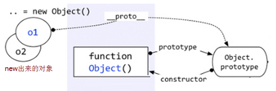
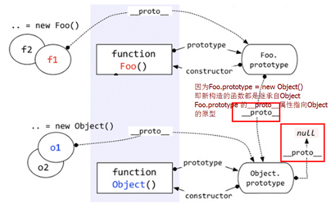

title: "原型及原型链"
date: 2015-05-20 23:02:45
categories: javascript
tags: [javascript]
description: 原型及原型链的第一次总结。
---
###原型、原型链
原型：对象。
先理一理`constructor、prototype、__proto__、Function、Object`等之间的关系。
```
function A() {};
A.prototype == A.constructor.prototype //fasle ------1
A.prototype == A.__proto__  
//false ------2
A.__proto__ == A.constructor.prototype 
//true -------3
```
解释：此时A是一个构造函数，也是一个函数，而函数是`Function`的实例。
所以A.constructor // Function ,回到第一条，构造函数的原型不等于Function的原型。
再来通俗解释`__proto__`：属性`__proto__`引用了创建这个对象的函数（构造函数）的prototype。
根据这个定义，第二条`A.__proto__`//Function.prototype
**__proto__是某个实体对象的属性（所以A.prototype也有这个属性，且指向Object.prototype，因为A.prototype初始化是个空对象（Object的实例）），prototype则是构造器函数的属性**。

根据以上的理解，再配合一幅图来理解。



图里的`__proto__`链就是传说中的原型链！，而原型链的作用跟作用域链相似，都是为了查找标识符（在我看来）。
	
通过原型链实现继承时，不能使用对象字面量的方法创建原型方法
`即`这样做原型先继承了实例，接着又重写了原型（对象字面量方法），导致继承失败。

```
function A() {};
var a = new A();
a.__proto__ == A.prototype //true 
```

```
function A() {}
function B() {}
B.prototype = new A();
B.prototype.constructor = B;
//需要手动将constructor调整回到B
b = new B();
```
因为`B.prototype = new A()` 继承后，`B.prototype的__proto__`指向了`A.prototype`,而`A.prototype`有个`constructor属性`指向A所以`B.prototype.constructor `变成了A
如果不手动调整constructor的话`b.constructor` 会成A

**constructor**属性
这个属性引用的是一个构造函数。
```
function A() {
	
} 
var a = new A();
//a.constructor →function A() {}
var b = new a.constructor();
```


原创文章，转载请注明出处！
